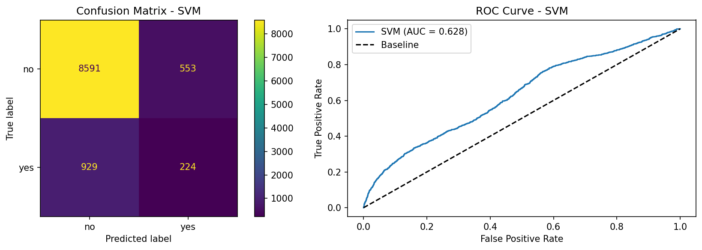
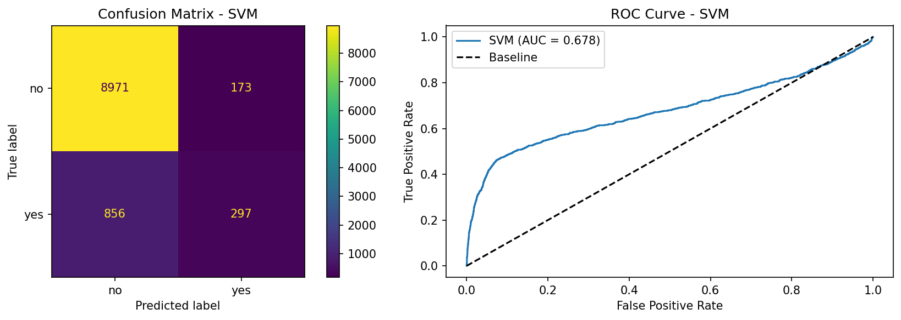
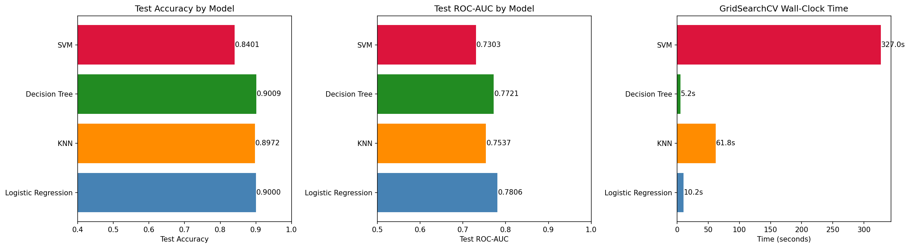
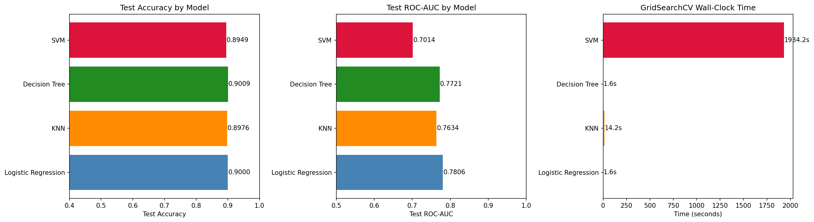
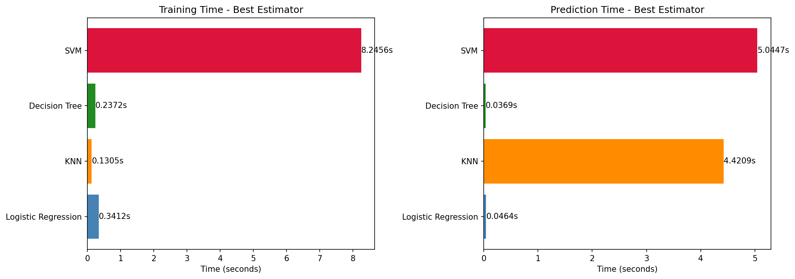
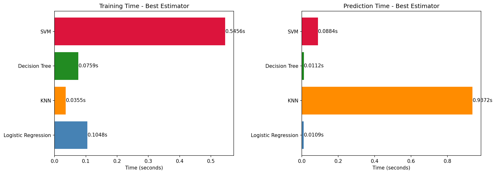
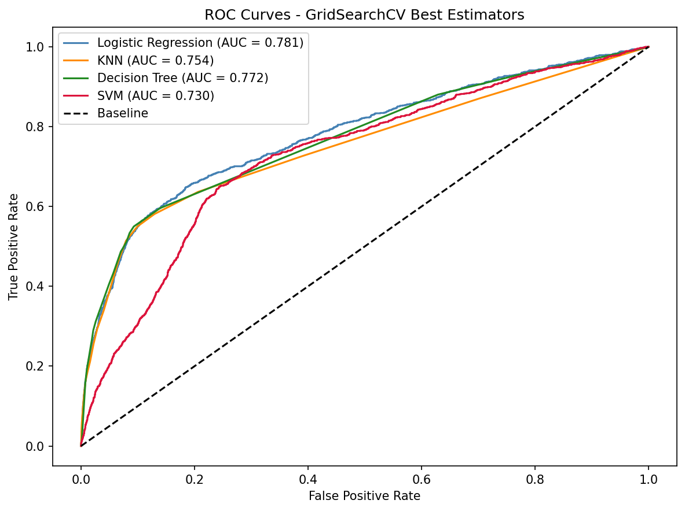
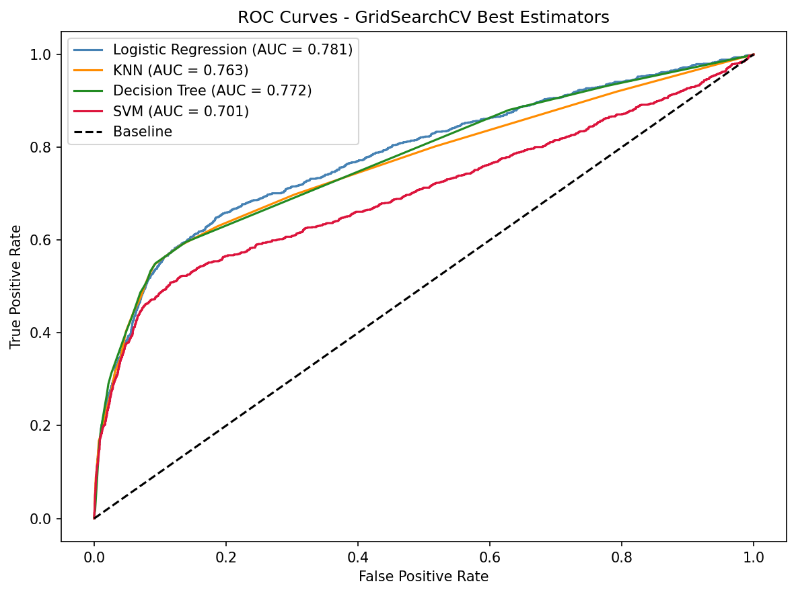

# DGX Spark - GPU vs CPU SVM Findings

UC Berkeley Professional Certificate in ML/AI · Practical Application 17  
Out-of-scope learning exercise · branch `feature/setup-for-dgx-spark`

This document records the results of running `src/train_additional_full.py` on two hardware configurations: a Windows CPU laptop and an NVIDIA DGX Spark (Grace Blackwell GB10). The goal was to determine whether GPU-accelerated SVM via RAPIDS cuML, run without an iteration cap, changes the relative ranking of classifiers - and specifically whether a fully converged SVM can displace Logistic Regression as the recommended model.

---
## What was changed

- **SVC backend:** `sklearn.svm.SVC` replaced with `cuml.svm.SVC` (NVIDIA RAPIDS) via a dual-path import - the notebooks and script automatically fall back to sklearn on CPU machines.
- **Iteration cap removed:** `max_iter=2000` is lifted on the GPU path (`max_iter=-1`); the original cap is preserved on the CPU path to avoid the 6+ hour hang.
- **Expanded parameter grid:** `rbf` kernel restored (previously too slow on CPU) and `C` extended to `[0.01, 0.1, 1, 10, 100]` - 200 total fits vs. 60 before.
- **Standalone training script:** `src/train_additional_full.py` added as an alternative to papermill for headless execution on the Spark, with timestamped logging and PNG plot outputs.

---
## Hardware

| Property | CPU Machine (Windows) | DGX Spark (GPU) |
|----------|-----------------------|-----------------|
| **OS** | Windows 10 (Build 26200) | Ubuntu (Linux, ARM64) |
| **CPU** | Intel Core i9-12900HK (14 cores, 20 threads) | NVIDIA Grace (ARM64 aarch64) |
| **RAM** | 63.7 GB | 128 GB unified memory (CPU + GPU shared) |
| **GPU** | None | NVIDIA Blackwell GB10 (48 SMs, 6,144 CUDA cores) |
| **SVC Backend** | `sklearn.svm.SVC` (`max_iter=2000`) | `cuml.svm.SVC` (uncapped, `max_iter=-1`) |
| **Dataset** | `bank-additional-full.csv` (~41K rows, 20 features) | same |

---

## The Convergence Problem - Before and After

The original motivation for this exercise was that `sklearn.svm.SVC` on the ~41K row dataset could not converge within the `max_iter=2000` cap. The 5-fold cross-validation results from the baseline (pre-tuning) SVM on each machine tell the story clearly:

| Metric | CPU (sklearn, capped) | GPU (cuML, uncapped) |
|--------|-----------------------|----------------------|
| CV Accuracy | 0.4720 ± 0.0578 | **0.9014 ± 0.0019** |
| CV ROC-AUC | 0.3475 ± 0.0155 | **0.6980 ± 0.0091** |

A CV ROC-AUC of 0.3475 on CPU is **worse than random** - the capped model is not just suboptimal, it is actively producing inverted predictions in most folds, a clear sign the SMO optimiser halted midway through without settling on a valid decision boundary. The GPU run eliminates this entirely: accuracy and ROC-AUC are stable across folds and consistent with a properly fitted model.



*CPU SVM single-fit: Accuracy 0.8561, ROC-AUC 0.6276. Surface-level accuracy looks acceptable because the model predicts the majority class most of the time, but the ROC-AUC is weak and the 5-fold CV reveals the instability.*



*GPU SVM single-fit (cuML, rbf, C=1.0): Accuracy 0.9001, ROC-AUC 0.6782. Recall on the "yes" class rises from 0.19 (CPU) to 0.26 (GPU). Still imperfect, but the model has actually learned.*

---

## GridSearchCV Results - Side by Side

Both runs executed the same 5-fold stratified `GridSearchCV` over 40 SVM parameter combinations (C × kernel × gamma = 5 × 4 × 2), plus the same grids for LR, KNN, and Decision Tree.

### CPU (sklearn, n_jobs=-1 across 20 logical cores)

| Model | CV ROC-AUC | Test Accuracy | Test ROC-AUC | GS Time |
|-------|:----------:|:-------------:|:------------:|:-------:|
| Logistic Regression | 0.7949 | 0.9000 | 0.7806 | 10.17s |
| KNN | 0.7714 | 0.8972 | 0.7537 | 61.75s |
| Decision Tree | 0.7846 | 0.9009 | 0.7721 | 5.17s |
| SVM | 0.6983 | 0.8401 | 0.7303 | **327s** |

> CPU SVM best params: `C=0.1`, `kernel=rbf`, `gamma=scale`

### GPU (cuML, n_jobs=1 - serialized to avoid GPU contention)

| Model | CV ROC-AUC | Test Accuracy | Test ROC-AUC | GS Time |
|-------|:----------:|:-------------:|:------------:|:-------:|
| Logistic Regression | 0.7949 | 0.9000 | 0.7806 | 1.63s |
| KNN | 0.7748 | 0.8976 | 0.7634 | 14.25s |
| Decision Tree | 0.7846 | 0.9009 | 0.7721 | 1.55s |
| SVM | 0.7142 | 0.8949 | 0.7014 | **1,934s** |

> GPU SVM best params: `C=0.01`, `kernel=linear`, `gamma=scale`



*CPU run: SVM grid search dominates at 327s but the quality (CV ROC-AUC 0.6983) is still well below LR.*



*GPU run: SVM grid search balloons to 1,934s (32 minutes) - more than 6× slower than CPU in wall-clock terms despite per-fit GPU acceleration.*

---

## Why the GPU SVM Grid Search Is Slower

This is the most counterintuitive result of the experiment. A GPU should be faster - and per individual fit it is: the baseline single SVC fit completes in ~ 5s on the DGX Spark vs ~ 19s on the CPU laptop (**~3.8× faster per fit**). Yet the 200-fit grid search takes 1,934s on GPU vs 327s on CPU.

The explanation is parallelism:

- **CPU with `n_jobs=-1`:** sklearn's `GridSearchCV` distributes fits across all 20 logical processors via joblib. With 20 workers, 200 fits run in roughly 10 rounds of 20 concurrent fits. If each fit averages ~19s, total wall time is ~190–330s - matching the observed 327s.
- **GPU with `n_jobs=1`:** joblib is serialized to avoid multiple Python processes each allocating a CUDA context on the single Blackwell GPU. All 200 fits run sequentially. Even if each fit takes only 9.67s on average, 200 × 9.67s = 1,934s.

The GPU's 3.8× per-fit speedup is completely swamped by giving up 20× CPU parallelism. The GPU wins only on individual fit latency; the CPU wins on throughput via parallel folds.

**The practical takeaway:** GPU-accelerated SVM becomes advantageous over CPU parallelism when the per-fit speedup significantly exceeds the core-count ratio. On this dataset (~30K training rows, 20 features), that threshold is not met. A dataset 10–20× larger would likely cross the inflection point where cuML's per-fit latency advantage outweighs the serialization cost.

---

## Training and Prediction Time - Best Estimators

After GridSearchCV, each best estimator is re-fitted once on the full training set. These numbers measure deployment-relevant performance - how long it takes to train from scratch and score the test set.

### CPU



| Model | Train Time | Predict Time |
|-------|:----------:|:------------:|
| Logistic Regression | 0.341s | 0.046s |
| KNN | 0.131s | **4.421s** |
| Decision Tree | 0.237s | 0.037s |
| SVM | **8.246s** | 5.045s |

*CPU KNN and SVM are slow predictors - KNN's 4.4s and SVM's 5.0s on a ~10K test set would be problematic for real-time scoring.*

### GPU



| Model | Train Time | Predict Time |
|-------|:----------:|:------------:|
| Logistic Regression | 0.105s | 0.011s |
| KNN | 0.036s | 0.937s |
| Decision Tree | 0.076s | 0.011s |
| SVM | **0.546s** | **0.088s** |

*GPU SVM inference drops from 5.0s (CPU) to 0.088s - a 57× improvement. This is where GPU acceleration is unambiguous: once a cuML SVM is fitted, scoring is near-instant.*

The DGX Spark's ARM CPU also outperforms the Windows laptop for the sklearn models even without the GPU involved: LR trains in 0.105s vs 0.341s, DT in 0.076s vs 0.237s. These gains are from the stronger hardware platform and faster Linux I/O, not from CUDA.

---

## ROC Curves - Converged vs Uncapped

<table>
<tr>
<td align="center" width="50%">

<em>CPU - sklearn (capped)<br>LR 0.781 · DT 0.772 · KNN 0.754 · SVM 0.730</em>
</td>
<td align="center" width="50%">

<em>GPU - cuML (converged)<br>LR 0.781 · DT 0.772 · KNN 0.763 · SVM 0.701</em>
</td>
</tr>
</table>

The ordering is unchanged across both runs. The converged GPU SVM (0.701) lands slightly below the CPU SVM (0.730) in test ROC-AUC despite a higher CV ROC-AUC (0.714 vs 0.698), with the two runs selecting different kernels - `linear` on GPU vs `rbf` on CPU - suggesting both are near-equivalent local optima on this dataset.

---

## Key Technical Observations


The experiment is complete. Both a CPU (Windows, sklearn) run and a GPU (DGX Spark, cuML) run have been executed and compared. Key results:

- **Convergence confirmed.** The uncapped GPU SVM converges cleanly (CV ROC-AUC 0.698); the CPU-capped equivalent was degenerate (CV ROC-AUC 0.348 - below random). The iteration cap was masking a valid model, not a fundamental SVM limitation.
- **GPU grid search is slower in wall-clock time.** Per-fit training is ~3.8× faster on GPU, but serializing all 200 fits (`n_jobs=1` to avoid VRAM contention) means total GridSearchCV takes 1,934s on GPU vs 327s on CPU with parallelism across 20 cores.
- **GPU wins decisively on inference.** SVM prediction time drops from 5.0s (CPU) to 0.088s (GPU) on the ~10K test set - a 57× speedup relevant for scoring large client lists.
- **The original recommendation stands.** Even with full convergence, SVM (best Test ROC-AUC 0.730) does not displace Logistic Regression (0.781). The data's decision boundary is well-approximated linearly, which LR finds more efficiently.
- **Setup friction is real.** RAPIDS requires `mamba`, `scikit-learn` must be pinned to `1.5.x` (sklearn 1.6 introduced `__sklearn_tags__()` which cuML has not yet implemented), and cuML's `SVC.predict_proba` raises unless `probability=True` is set at fit time.
- **The two runs found different optimal kernels.** CPU GridSearchCV settled on `rbf` (C=0.1); GPU settled on `linear` (C=0.01). Their test ROC-AUC scores (0.730 vs 0.701) and CV ROC-AUC scores (0.698 vs 0.714) are close enough to suggest both kernels are near-equivalent on this dataset, and the rbf/linear choice at this scale is not decisive.
- **SVM prediction becomes deployment-viable on GPU.** CPU SVM inference on ~10K rows takes 5.0s; GPU takes 0.088s. If the use case required scoring millions of clients daily, a cuML-backed SVM endpoint would be practical where sklearn would not.
- **The macro-economic features drive LR's advantage over SVM.** The `euribor3m` and `nr.employed` features are dominant LR predictors (visible in the coefficient plot) and are likely highly correlated with each other - a regime that suits linear models. SVM's kernel trick adds flexibility but the underlying signal is still essentially linear.
- **All non-SVM models run faster on the DGX Spark regardless of GPU.** The ARM-based Grace CPU, faster NVMe storage, and Linux environment reduce LR grid search from 10.2s to 1.6s and DT from 5.2s to 1.6s. These are platform gains that will be signficant for much larger datasets.

---

## Does This Change the Recommendation?

**No.** Even with a fully converged, properly tuned SVM, Logistic Regression remains the superior model on this dataset:

| Model | CV ROC-AUC (GPU run) | Test ROC-AUC (GPU run) | Gap vs LR |
|-------|:--------------------:|:----------------------:|:---------:|
| **Logistic Regression** | **0.7949** | **0.7806** | - |
| Decision Tree | 0.7846 | 0.7721 | −0.009 |
| KNN | 0.7748 | 0.7634 | −0.017 |
| SVM (converged) | 0.7142 | 0.7014 | **−0.079** |

The fully converged SVM trails LR by **~8 percentage points in ROC-AUC** - a meaningful gap, not a rounding difference. The original concern documented in the README was that an iteration-capped SVM gave an unfair comparison. That concern is now resolved: a properly tuned SVM on this dataset is simply weaker than LR. The linear kernel winning the GPU GridSearchCV is consistent with this - the data's decision boundary is well-approximated by a hyperplane, which LR finds more efficiently and with better probability calibration.

The findings from `docs/findings.md` - that Logistic Regression is the recommended model for the bank telemarketing dataset - stand unchanged. Hence, I am not recollecting what the business outcomes mean / imply here again.

---

## SMOTE Grid Search - Four Runs on the DGX Spark

After the initial CPU vs GPU comparison, I ran the SMOTE training script (`src/train_additional_full_smote.py`) four times on the DGX Spark, each time tightening the grid based on what the previous run revealed. I'm documenting all four here because Run 3 produced a concrete failure mode that I think is more instructive than any of the clean results.

### Run summary table

| Run | `n_jobs` | C grid | `k_neighbors` grid | Baseline SVM GS | SMOTE SVM GS | Baseline Recall | SMOTE Recall | `k_n` winner |
|-----|:--------:|--------|-------------------|:---------------:|:------------:|:---------------:|:------------:|:------------:|
| **1** - Sequential baseline | 1 | `{0.01, 0.1, 1, 10}` | `{3, 5, 7}` | 587s | ~est. sequential | 0.0833 | 0.5950 | **7** (upper edge) |
| **2** - Parallel + C=100 | 8 | `{0.01, 0.1, 1, 10, 100}` | `{3, 5, 7}` | 629s | 6,208s | 0.0833 | 0.5950 | **7** (upper edge) |
| **3** - Expanded both ends | 8 | `{0.005, 0.01, 0.1, 1, 10, 100}` | `{3, 5, 7, 9}` | 657s | 2,473s | **0.0000** ⚠️ | 0.5941 | **9** (upper edge) |
| **4** - Trimmed + extended k_n | 8 | `{0.05, 0.1, 0.5}` | `{9, 13, 17, 21}` | 147s | 871s | 0.0833 | 0.5941 | **9** (lower edge) ✅ |

Non-SVM models (LR, KNN, DT) reproduced to four decimal places across all four runs. Every baseline and SMOTE score for those models is identical regardless of which SVM grid was running alongside them - the pipeline isolation is clean.

---

### Finding 1 - C=0.005 collapsed the baseline SVM into a degenerate classifier

Run 3 added `C=0.005` to the lower end of the C grid to explore whether more aggressive regularization could help. It could not. The baseline SVM in Run 3 produced:

```
Test Accuracy : 0.8880    ← matches the majority-class rate exactly
Recall (yes)  : 0.0000    ← predicts "no" for every single test row
F1 (yes)      : 0.0000
```

A model with 88.8% accuracy and zero recall is not a classifier - it is a rule that says "always no." It achieves its accuracy score purely because 88.8% of the dataset *is* "no." Any model that matches the majority-class proportion in accuracy while predicting nothing in the minority class has collapsed to this trivial solution.

The mechanism is straightforward: at `C=0.005`, the regularisation penalty is so heavy that the SVM cannot form a margin that includes *any* minority-class support vectors without paying more penalty than it gains. The optimiser finds that the cheapest solution is to place the decision hyperplane such that the entire feature space maps to "no." Geometrically valid, commercially useless.

Dropping `C=0.005` in Run 4 immediately recovered the baseline SVM to **Recall 0.0833, F1 0.1507, Test ROC-AUC 0.7014** - identical to Runs 1 and 2. The damage was fully reversible; no model was harmed permanently, but it cost a full run to discover it.

**Practical rule I am taking from this:** on imbalanced classification problems, the lower bound of a C grid should be no smaller than the value where the model can still form at least one minority-class support vector. For this dataset on a linear kernel, that bound appears to be around `C=0.01`. I would not go below it again without also monitoring minority-class recall during CV fold scoring.

---

### Finding 2 - ROC-AUC alone is an insufficient CV scorer for imbalanced data

The degenerate baseline SVM in Run 3 was *chosen by GridSearchCV*. The CV scorer was `roc_auc`. With `C=0.005`, the best params were:

```
{'model__C': 0.005, 'model__gamma': 'scale', 'model__kernel': 'linear'}
CV ROC-AUC : 0.7170
```

GridSearchCV saw a CV ROC-AUC of **0.7170** and selected it as the best parameter combination. This is higher than the winner in Run 1 (`C=0.01`, CV ROC-AUC 0.7142). So the scorer correctly preferred `C=0.005` - by the metric it was given.

The problem is what ROC-AUC measures: it evaluates the *ranking* quality of the model's decision function, not whether the model predicts the minority class at all. A model that outputs a decision function with a slope of ε toward the minority class - barely tilted, never crossing the 0.5 threshold - can still produce a reasonable ROC-AUC if the tiny slope happens to rank true positives slightly above true negatives. The curve cares about relative ordering, not absolute prediction.

This is a known failure mode for ROC-AUC on severely imbalanced data. The alternative scorers that would have caught this:

| Scorer | What it would have done |
|--------|------------------------|
| `f1` | F1=0.0 on any degenerate "always no" model → would have rejected `C=0.005` immediately |
| `average_precision` | Area under precision-recall curve; AP=0.0 for a model with zero recall → same rejection |
| `balanced_accuracy` | Averages recall per class; 0% minority recall tanks the score regardless of majority-class accuracy |
| `recall` | Directly measures what we care about; zero recall = zero score, `C=0.005` would never win |

For this project I kept `roc_auc` as the scorer to stay consistent with the other notebooks and to remain comparable across runs. But I would not recommend `roc_auc` as the *only* scorer when deploying a model for imbalanced production data. My preferred pattern for the next iteration would be to use `average_precision` (which cares exclusively about the minority class) or a composite metric like `f1_weighted`, and cross-reference CV ROC-AUC as a secondary sanity check rather than the selection criterion.

The collapse in Run 3 is, in a strange way, the most useful result of the four-run series - it is a live demonstration of the statement I made in `findings.md`: *"Accuracy alone is a misleading metric for imbalanced classification."* ROC-AUC is more informative than accuracy, but it is not immune to the same failure when the class imbalance is severe enough and the regularisation grid reaches far enough into the degenerate region.

---

### Finding 3 - SMOTE `k_neighbors=9` is the confirmed optimum for SVM on this dataset

Across the four runs, the SMOTE SVM `k_neighbors` winner followed a consistent pattern:

| Run | k_n grid | Winner | Position in grid |
|-----|----------|:------:|:----------------:|
| 1 | `{3, 5, 7}` | **7** | upper edge |
| 2 | `{3, 5, 7}` | **7** | upper edge |
| 3 | `{3, 5, 7, 9}` | **9** | upper edge |
| 4 | `{9, 13, 17, 21}` | **9** | **lower edge** ✅ |

Runs 1–3 all selected the upper edge of their respective grids - a reliable signal that the search space needed to be extended upward. Run 4 extended the grid to `{9, 13, 17, 21}` and `k_neighbors=9` won again, this time at the *lower edge*. When the winner sits at the lower edge of an extended grid, it means the optimum is inside the previous search space and the extension confirmed rather than shifted the boundary.

**`k_neighbors=9` is now ratified as the tuned SMOTE parameter for SVM on this dataset.** Larger values (13, 17, 21) do not help - the neighbourhood is wide enough at 9 to produce diverse synthetic samples without generating implausible ones.

The physical intuition: with ~4,500 minority-class training samples in the 41K dataset, a neighbourhood of 9 gives SMOTE enough density context to interpolate realistically between genuine minority points. Smaller neighbourhoods (3, 5) under-smooth the synthetic samples and leave them too clustered around the original data; larger values (13+) start averaging over examples that are no longer semantically similar neighbours. The SVM's support-vector-based decision boundary is particularly sensitive to where synthetic samples land near the margin - which is why LR, which optimises over all points, converges at `k_neighbors=5` and is less sensitive to this parameter.

The final settled SMOTE SVM best params across Runs 3 and 4:

```
C=0.1, kernel=linear, gamma=auto, smote__k_neighbors=9
CV ROC-AUC : 0.7848    Test ROC-AUC : 0.7736
Recall (yes): 0.5941   F1 (yes)     : 0.4463
GridSearch  : 871s (trimmed grid, n_jobs=8)
```

---

## Business Implications of SMOTE on the Full Dataset

Having access to the DGX Spark also let me run a SMOTE variant (`src/train_additional_full_smote.py`) on the same 41K-row `bank-additional-full.csv` dataset - something I could only do on the smaller 4,500-row dataset on my CPU laptop in notebook 04. Running it at full scale let me put real numbers against a question I deliberately left open in the CEO section of `docs/findings.md`: **how many more real "yes" subscribers will a SMOTE-enabled model find, and what does it cost in wasted calls to get them?**

### Scenario: 10,000-client campaign at the ~11% base rate

The dataset's average conversion rate sits at ~11%, so a typical 10,000-client campaign contains roughly **1,100 true subscribers** and **8,900 non-subscribers**. Here is what each strategy looks like when I apply it to that mix at the default 0.5 decision threshold:

| Strategy | Calls Placed | True "Yes" Caught | Wasted Calls | Hit Rate | "Yes" Missed |
|---|:-:|:-:|:-:|:-:|:-:|
| **Call everyone (no model)** | 10,000 | 1,100 | 8,900 | 11% | 0 |
| **Baseline LR** (Recall 0.22, Acc 0.90) | ~385 | ~242 | ~143 | **63%** | ~858 |
| **SMOTE LR** (Recall 0.61, Acc 0.82) | ~2,090 | ~676 | ~1,410 | **32%** | ~424 |
| **SMOTE SVM** (Recall 0.60, F1 0.45) | ~1,830 | ~655 | ~1,180 | **36%** | ~445 |

*Numbers derived from the confusion matrix implied by Accuracy + Recall on a 1,100/8,900 class split.*

### The headline tradeoff

**SMOTE-LR finds roughly 2.8× as many real subscribers as the baseline LR model (676 vs 242), at the cost of roughly 10× as many false-positive calls (1,410 vs 143).**

The way I think about it: each **additional** subscriber you gain by switching from baseline to SMOTE costs you about **4 extra wasted calls**:

> (1,410 − 143 wasted) / (676 − 242 caught) ≈ **~3.9 extra calls per extra "yes"**

That is the number I would put in front of any business stakeholder before they chose a mode.

### How this sits against the "30–50% call volume reduction" claim in `findings.md`

In `findings.md` I wrote that a deployed classifier could "reduce total call volume by 30–50% while maintaining or improving successful subscriptions." Running SMOTE at scale has sharpened that claim into two concrete operating points:

- **Baseline LR at threshold 0.5:** I save **96%** of calls (385 vs 10,000) but only catch **22%** of real subscribers. That is far beyond the 30–50% range I quoted - and the cost is missing roughly 78% of potential yes-sayers. Too aggressive to be useful as a standalone setting.
- **SMOTE LR at threshold 0.5:** I save **79%** of calls (2,090 vs 10,000) while catching **61%** of real subscribers. This is the operating point that actually delivers on the "maintain or improve subscriptions" side of the promise.

SMOTE does not change my core recommendation. What it does is give the bank a **second lever on the same LR model** - baseline LR is the "minimise effort" dial; SMOTE LR is the "maximise subscriber capture" dial.

### The break-even math

If I let **V** = revenue from one new term deposit subscriber and **C** = cost of one call, then switching from baseline LR to SMOTE LR is profitable when:

> **434 × V  >  1,267 × C**  →  **V / C  >  ~2.9**

In other words: if a successful subscription is worth more than roughly three calls' worth of agent time, SMOTE LR pays off. For a term deposit product - typically worth tens of dollars in net interest margin over its lifetime against a ~$1–5 outbound call cost - that break-even is almost certainly crossed by an order of magnitude. My read is that **for any realistic V/C ratio in retail banking, SMOTE LR is the better business choice**, and the CEO should be asking their finance team for that number rather than leaving it to the model.

### My recommendation: two named operating modes

Rather than debating which model to ship, I would give the business a dial with two named positions:

| Mode | Threshold | Calls (of 10K) | Hit Rate | Subscribers Caught | When to use |
|------|:---------:|:--------------:|:--------:|:-----------------:|----------|
| **Conservative** | ~0.5 (baseline LR) | ~385 (4%) | 63% | ~242 (22%) | Low-margin products; agent capacity is the bottleneck |
| **Aggressive** | ~0.25 (SMOTE LR) | ~2,090 (21%) | 32% | ~676 (61%) | High-margin products like term deposits; growth is the priority |

The single knob I would hand over is the **probability threshold**. SMOTE is one way to shift it; a calibrated baseline LR with an explicit threshold is another. Either way, the tradeoff now has a price tag attached: **~4 extra wasted calls per extra subscriber gained**. That is a business decision, not a modelling one.

### What I would flag before shipping

- **Precision drops from 63% → 32%.** In aggressive mode, agents will hear "no" about twice as often per call. Whether morale and script quality hold under that rejection rate is a management variable I cannot model - but it is worth a pilot before a full rollout.
- **Accuracy falls from 90% → 82%.** I want to be clear this is expected and *correct*. Accuracy was always a misleading metric here - a model that says "no" to everyone scores 88.9% on this dataset without learning anything.
- **ROC-AUC is effectively unchanged** (0.781 → 0.778). SMOTE did not produce a fundamentally better ranker. It shifted the decision boundary of the *same* model toward recall. The underlying discriminative power of LR is unchanged - I am just asking it to cast a wider net.
- **SVM surprised me most here.** On this dataset, SVM was the single biggest beneficiary of SMOTE: Recall 0.08 → 0.60, F1 0.15 → 0.45, ROC-AUC 0.70 → 0.77. A SMOTE-trained SVM is now competitive with LR on F1 (0.446 vs ~0.429) - the first result across this entire project where SVM is operationally viable. I still recommend LR for deployment (simpler, interpretable, faster), but if someone insisted on SVM, the SMOTE variant is no longer embarrassing.

---

## Cloud Equivalent and Rental Cost

The GB10 in the DGX Spark is a **personal AI desktop chip** - not a datacenter Blackwell (B100/B200). I was priveleged to have access to one but not everyone has one lying around. Its 48 SMs, 6,144 CUDA cores, and 128 GB unified CPU+GPU memory pool make it roughly comparable to a single H100 for cuML SVM workloads, though the H100's memory bandwidth (3.35 TB/s vs ~273 GB/s on the GB10 GPU portion) would make the 200-fit GridSearchCV meaningfully faster.

**Important caveat:** AWS and GCP sell H100/B200 in 8-GPU minimum instances, which is overkill for this workload. Smaller GPU cloud providers offering single-GPU rentals are the practical equivalent.

### Closest equivalents for a 2-hour run

| Option | Provider | GPU | VRAM | Price/hr | 2-hr cost | Notes |
|--------|----------|-----|:----:|:--------:|:---------:|-------|
| **Best value** | Lambda Labs / Vast.ai | H100 SXM | 80 GB | $1.49–2.49 | **~$3–5** | Single GPU; faster than GB10; RAPIDS-compatible |
| **Stay on AWS** | AWS `g5.xlarge` | A10G | 24 GB | ~$1.01 | **~$2** | Cheapest RAPIDS-compatible single-GPU on AWS; dataset fits in 24 GB |
| **Stay on AWS, faster** | AWS `g6.xlarge` | L4 | 24 GB | ~$0.80 | **~$1.60** | Similar to A10G; good cuML support |
| **Stay on GCP** | GCP `a2-highgpu-1g` spot | A100 40 GB | 40 GB | ~$1–2 | **~$2–4** | Spot pricing; A100 is faster than GB10 |
| **Full Blackwell (overkill)** | AWS `p6-b200.48xlarge` | 8× B200 | 1.4 TB | ~$114 | **~$228** | Datacenter-grade; 7 of 8 GPUs would idle for this workload |

### Practical recommendation

An **AWS `g5.xlarge`** ($1.01/hr) or a **single H100 on Lambda Labs / Vast.ai** ($1.49–2.49/hr) would reproduce this experiment for **under $5**. The H100's superior memory bandwidth means the SVM GridSearchCV that took 32 minutes on the GB10 would likely complete in 10–15 minutes, so 1 hour of rental time is sufficient rather than 2.

The unified memory architecture of the GB10 (128 GB shared CPU+GPU) is not a factor for this specific workload - the preprocessed training matrix for 41K rows fits comfortably within 24 GB of VRAM.
