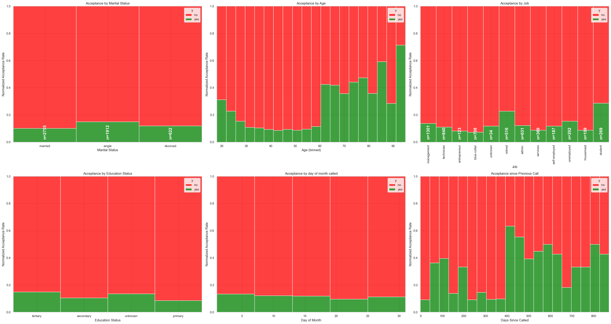
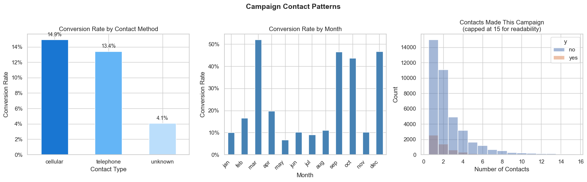
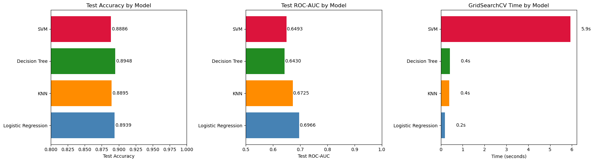
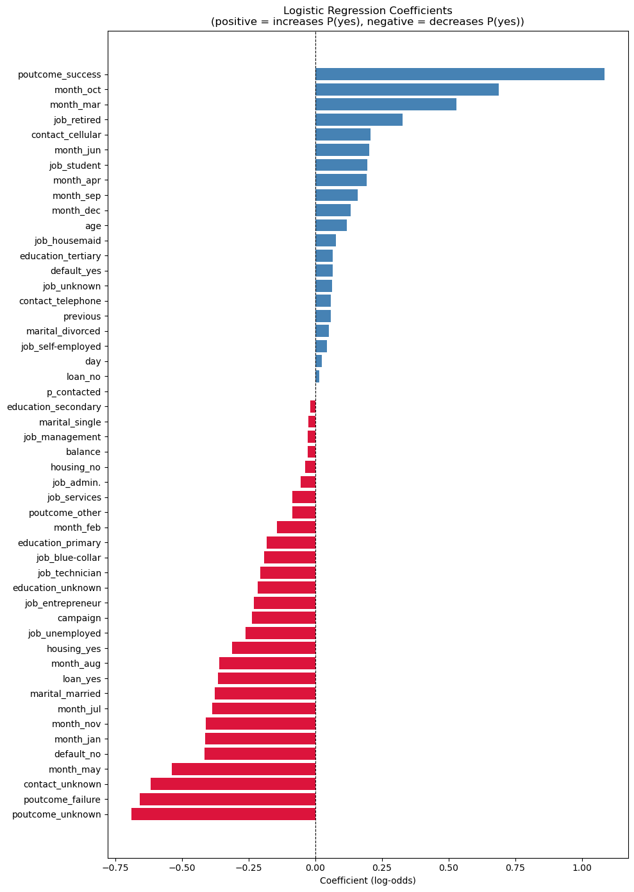
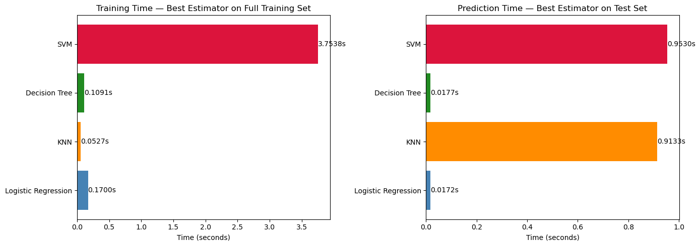
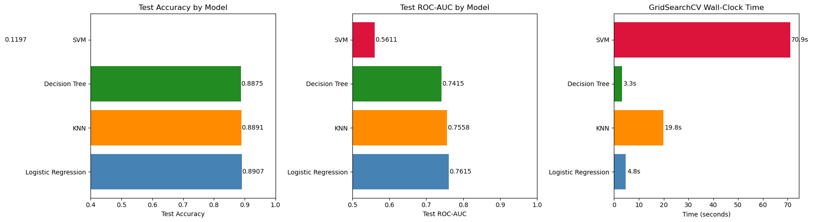
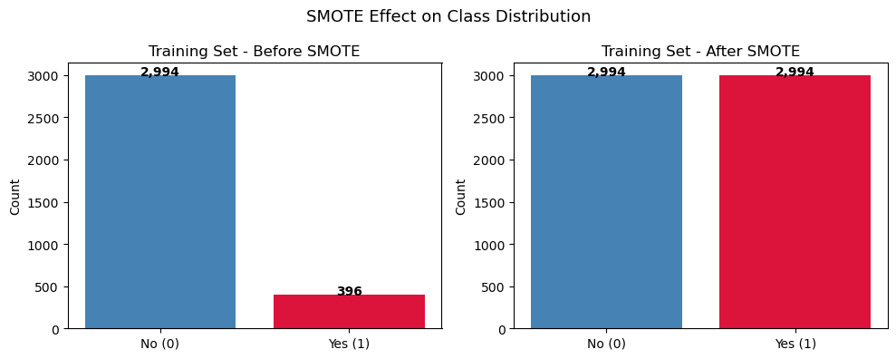
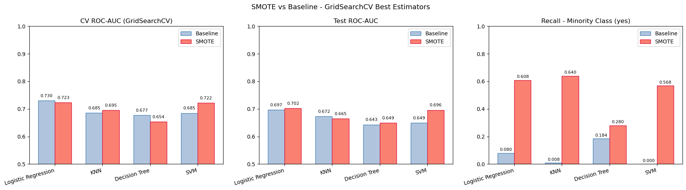
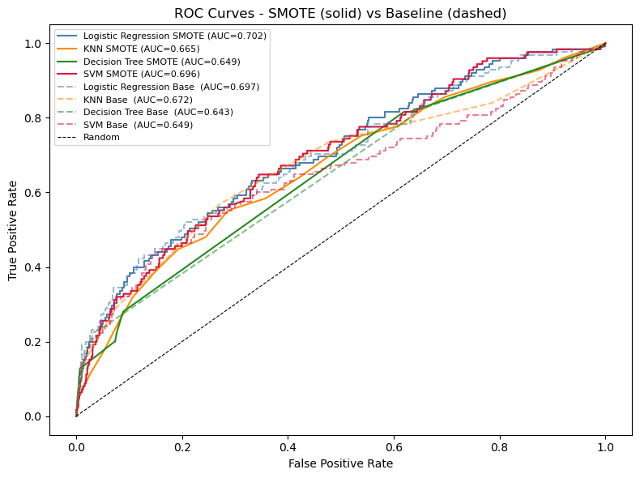

# Findings Summary — Comparing Classifiers

UC Berkeley Professional Certificate in ML/AI · Practical Application 17

This document summarises the key findings across all five notebooks. Results are based on the Bank Marketing dataset from a Portuguese banking institution.

---

## 00 — Exploratory Data Analysis

**Dataset:** `bank-full.csv` (~45,000 rows, 15 features)

### Class Imbalance

The target variable `y` (term deposit subscription) is heavily skewed: approximately **88.5% of clients said *no***, leaving only ~11.5% positive cases. This means a basic classifier that always predicts "no" achieves ~88.5% accuracy without learning anything useful. **Accuracy alone is therefore a misleading metric** — precision, recall, and ROC-AUC are more informative.

### Categorical Features

- **Age & Occupation:** Subscription rates are notably higher among retired clients and students. Rates tick up after age 60. No strong pattern emerged from marital status alone.
- **Education:** Some signal exists but the ordering is non-linear, suggesting an ordinal or nominal encoding strategy is worth exploring.
- **Contact Method:** Cellular contact outperforms telephone outreach in conversion rate.
- **Month / Day:** Conversion rates are elevated in Q4 (September–December, except November) and in March — likely reflecting local tax-cycle behaviour. The November dip may be a sandwich effect between two high-conversion months.

### Campaign Contact Patterns

- Clients contacted fewer times convert at higher rates — repeated calls have diminishing (and eventually negative) returns.
- Clients successfully contacted in a *prior* campaign (`poutcome = success`) have substantially higher conversion odds.
- Call `duration` is a strong predictor but is only known *after* the call ends, so it is excluded from all models to avoid data leakage.

---

## 01 — Model Training: Small Dataset (Baseline)

**Dataset:** `bank.csv` (~4,500 rows, 15 features, no SMOTE)

### Setup

- `duration` dropped (data leakage); `pdays` converted to a binary `p_contacted` flag
- Pipeline: `StandardScaler` (numeric) + `OneHotEncoder` (categorical) → model
- 75/25 train-test split; 5-fold stratified CV; `GridSearchCV` for tuning

### Results Summary (GridSearchCV best estimators)

All four models beat the naive 88.5% accuracy baseline, but **raw accuracy is not the right lens** given the class imbalance. ROC-AUC and minority-class recall tell the real story.

| Model | Test Accuracy | Test ROC-AUC | Recall (yes) | GS Time |
|-------|:------------:|:-----------:|:------------:|:-------:|
| Logistic Regression | 0.8939 | 0.6966 | 0.14 | 0.19s |
| KNN | 0.8895 | 0.6725 | 0.11 | 0.39s |
| Decision Tree | 0.8948 | 0.6430 | 0.23 | 0.41s |
| SVM | 0.8886 | 0.6493 | 0.15 | 5.93s |

> Naive majority-class dummy: Accuracy 0.8895, ROC-AUC 0.5000, Recall (yes) 0.00

### Key Observations

- **Logistic Regression** is the strongest performer on ROC-AUC (0.6966) and trains in under 0.2s — the most practical choice at this scale.
- **Decision Tree** has the highest raw accuracy (0.8948) post-tuning (best params: `max_depth=5`, `min_samples_split=10`) but lags on ROC-AUC (0.6430), confirming it learns a conservative, mostly-"no" rule.
- **KNN** (best params: `n_neighbors=21`, `metric=euclidean`) is competitive but slower and shows weaker minority-class recall (0.11).
- **SVM** (best params: `C=0.1`, `kernel=poly`) takes ~30× longer than LR for marginal accuracy gain and lower ROC-AUC.
- All models struggle to recall the minority "yes" class without resampling — even the best (DT at 0.23) misses roughly three-quarters of subscribers.

### Logistic Regression Coefficients

The coefficient plot reveals which features push the model toward predicting a subscription (actions someone in the bank can take on):

- **Positive drivers:** Prior campaign success (`poutcome_success`), longer engagement history, certain months (March, October)
- **Negative drivers:** `euribor3m` (higher interest rate environment suppresses subscriptions), previous campaign failure, `nr.employed`

---

## 02 — Model Training: Additional Full Dataset (20 Features)

**Dataset:** `bank-additional-full.csv` (~41,000 rows, 20 features including macroeconomic indicators)

### What's Different

This dataset adds five macroeconomic context columns absent from the 15-feature format:

| Feature | Description |
|---------|-------------|
| `emp.var.rate` | Employment variation rate (quarterly) |
| `cons.price.idx` | Consumer Price Index (monthly) |
| `cons.conf.idx` | Consumer Confidence Index (monthly) |
| `euribor3m` | Euribor 3-month interest rate (daily) |
| `nr.employed` | Number of employed (thousands, quarterly) |

These macro indicators capture the economic climate at the time of each call and are among the strongest predictors in the coefficient plot.

### Results Summary (GridSearchCV best estimators)

| Model | Test Accuracy | Test ROC-AUC | GS Time | Notes |
|-------|:------------:|:-----------:|:-------:|-------|
| Logistic Regression | 0.9000 | 0.7806 | 5.34s | Best ROC-AUC; macro features add clear lift |
| KNN | 0.8972 | 0.7535 | 18.22s | Competitive but slow to predict (0.91s/call) |
| Decision Tree | 0.9009 | 0.7721 | 2.87s | Best accuracy; `max_depth=5`, `entropy` criterion |
| SVM | 0.4299 | 0.6606 | 65.04s | Did not converge — accuracy meaningless |

> Naive majority-class dummy: Accuracy 0.8880, ROC-AUC 0.5000

### Key Observations

- Adding the five macroeconomic features produces a **meaningful ROC-AUC improvement** across all three well-behaved models (+0.05–0.08 vs notebook 01 GS results).
- **Decision Tree** is the accuracy leader here (0.9009) with best params `entropy`, `max_depth=5`, `min_samples_split=20`.
- **KNN** prediction time balloons to 0.91s on ~10k test rows — a practical concern for any real-time scoring system.
- **SVM** with `max_iter` cap results in a degenerate model (Test Accuracy 0.4299) — the cap prevents convergence and the results are not reliable. GridSearch selected `C=0.001`, `kernel=sigmoid`, itself a sign the optimiser is flailing.

### SVM Caveat

SVM is run with `kernel='sigmoid'` and `max_iter=2000` as a computational compromise. This is **not a fully tuned SVM** — it converges quickly but may not represent SVM's true ceiling. See the README for more context on the hardware constraint.

---

## 03 — Model Training: Full Dataset (15 Features)

**Dataset:** `bank-full.csv` (~45,000 rows, 15 features)

### Purpose

This notebook uses the same 15-feature schema as notebook 01 but with **10× more training data**, making it a clean controlled comparison: same features, same pipeline, same GridSearchCV setup — just more data.

### Key Observations

- **Logistic Regression** scales well — training time increases modestly and ROC-AUC improves from 0.6966 (small) to 0.7615 (full).
- **KNN** becomes noticeably slower at prediction time (1.25s vs 0.02s); its ROC-AUC also improves but lags LR.
- **Decision Tree** benefits from more data (`max_depth=10` selected vs `5` on the small set) but its ROC-AUC gain is smaller than LR's.
- **SVM** with `max_iter=2000` again produces a degenerate result (Test Accuracy 0.12, ROC-AUC 0.56) — the model failed to converge.

### Results Summary (GridSearchCV best estimators)

| Model | Test Accuracy | Test ROC-AUC | GS Time | Notes |
|-------|:------------:|:-----------:|:-------:|-------|
| Logistic Regression | 0.8907 | 0.7615 | 4.77s | Best ROC-AUC; consistent improvement vs small dataset |
| KNN | 0.8891 | 0.7558 | 19.84s | Strong ROC-AUC but prediction latency is high |
| Decision Tree | 0.8875 | 0.7415 | 3.32s | Solid; best params `entropy`, `max_depth=10` |
| SVM | 0.1197 | 0.5611 | 70.94s | Did not converge — results not meaningful |

> Naive majority-class dummy: Accuracy 0.8803, ROC-AUC 0.5000

---

## 04 — SMOTE: Addressing Class Imbalance

**Training dataset:** `bank.csv` (~4,500 rows) | **Generalization test:** `bank-full.csv` (~45,000 rows)

**Not required as part of assignment, I used it as an opportunity to explore and learn SMOTE. I did use Generative AI assistance here extensively to learn and setting up the SMOTE pipeline, correlating results with baseline to see impact.**

### The Problem SMOTE Solves

With a ~7.6:1 class imbalance in the training set (2,994 "no" vs 396 "yes"), classifiers without resampling are biased toward predicting "no". They achieve high accuracy by mostly ignoring the minority class — but the whole business value is in identifying the "yes" subscribers *before* the call.

**SMOTE** (Synthetic Minority Oversampling Technique) synthesises new minority examples in feature space to rebalance the training distribution, improving minority-class recall without simply duplicating records. After SMOTE: 2,994 "no" and 2,994 "yes" — a perfect 1:1 ratio.

### Baseline vs SMOTE Comparison (GridSearchCV)

| Model | Baseline CV ROC-AUC | SMOTE CV ROC-AUC | Baseline Recall (yes) | SMOTE Recall (yes) | Recall Δ |
|-------|:------------------:|:---------------:|:---------------------:|:-----------------:|:--------:|
| Logistic Regression | 0.7304 | 0.7228 | 0.08 | 0.61 | **+0.53** |
| KNN | 0.6855 | 0.6950 | 0.01 | 0.64 | **+0.63** |
| Decision Tree | 0.6767 | 0.6539 | 0.18 | 0.28 | +0.10 |
| SVM | 0.6849 | 0.7221 | 0.00 | 0.57 | **+0.57** |

### Key Observations

- SMOTE delivers **dramatic minority-class recall improvements** across LR (+0.53), KNN (+0.63), and SVM (+0.57) — the bank catches far more potential subscribers.
- This comes at a cost: raw accuracy drops sharply (e.g. LR from 0.8939 → 0.6676) because the model now predicts "yes" more aggressively, generating more false positives. Whether this tradeoff is worth it depends on the relative cost of a missed subscriber vs a wasted call.
- **ROC-AUC under SMOTE is broadly maintained or slightly improved** — notably SVM gains +0.04 in CV ROC-AUC, confirming the ranking ability is preserved even as the decision threshold shifts.
- **Decision Tree** responds least to SMOTE (+0.10 recall lift) — tree splits are less sensitive to synthetic oversampling because they operate on hard class boundaries.
- SMOTE is applied **only within each training fold** (via `ImbPipeline`) to avoid data leakage into validation folds.

### Logistic Regression Coefficients (SMOTE-trained)

The coefficient plot for the SMOTE-trained LR model follows a similar pattern to the baseline, but with re-weighted magnitudes — prior campaign outcome and economic indicators remain dominant.  

### Generalization Test on `bank-full.csv`

The models trained on ~4,500 rows were scored against the full 45,211-row dataset:

| Model | Type | Accuracy | ROC-AUC | Recall (yes) | F1 (yes) |
|-------|------|:--------:|:-------:|:------------:|:--------:|
| Logistic Regression | Baseline | 0.8912 | 0.7536 | 0.13 | 0.21 |
| Logistic Regression | SMOTE | 0.6754 | 0.7472 | 0.69 | 0.33 |
| KNN | Baseline | 0.8849 | 0.7157 | 0.03 | 0.06 |
| KNN | SMOTE | 0.6124 | 0.7155 | 0.70 | 0.30 |
| Decision Tree | Baseline | 0.8909 | 0.6917 | 0.22 | 0.32 |
| Decision Tree | SMOTE | 0.8432 | 0.6760 | 0.33 | 0.33 |
| SVM | Baseline | 0.8837 | 0.7100 | 0.01 | 0.02 |
| SVM | SMOTE | 0.7071 | 0.7365 | 0.64 | 0.34 |

> The SMOTE models generalise well on recall — patterns learned from the synthetic-balanced small dataset transfer to the real class distribution at scale. ROC-AUC remains close between baseline and SMOTE variants, confirming the resampling improves class-boundary placement without degrading the model's overall discriminative power.

---

## Overall Takeaways

1. **Accuracy is misleading** for imbalanced classification. Always check ROC-AUC and minority-class recall alongside it.
2. **Logistic Regression is the best all-around model** — fast to train (<0.2s), interpretable, and consistently leads on ROC-AUC across all dataset sizes (0.70 on small, 0.76–0.78 on full datasets).
3. **Macroeconomic features matter.** Adding the five macro indicators in the 20-feature dataset raises ROC-AUC by ~0.05–0.08 across models. `euribor3m` in particular is a dominant negative predictor — clients are less likely to subscribe when interest rates are high.
4. **Previous campaign outcome** (`poutcome_success`) is the single strongest positive signal — a prior success dramatically increases conversion odds.
5. **SMOTE is valuable** when the cost of missing a subscriber (false negative) outweighs the cost of a wasted call (false positive). KNN and SVM SMOTE variants push minority-class recall above 0.60–0.70 while maintaining ROC-AUC, which is a useful operating point for the bank.
6. **SVM is impractical at scale** without cloud compute — it is the clear computational outlier (65–70s GridSearch vs <5s for LR and DT) and failed to converge entirely on the full datasets with an iteration cap.
7. **More data helps LR and DT most.** KNN's prediction latency grows with dataset size (1.25s at 45k rows), making it less practical for real-time scoring despite competitive ROC-AUC.

---

## What This Means for the CEO or President of the Bank

The numbers throughout this document are useful for evaluating models, but the question that matters to the bank is simpler: **who should we call, when, and how?**

---

### Who Is Most Likely to Say Yes?

| Customer Profile | Approx. Conversion Rate | vs. Average |
|------------------|:-----------------------:|:-----------:|
| Previously subscribed (prior campaign success) | ~64% | **6× average** |
| Student | ~29% | ~2.6× average |
| Retired | ~23% | ~2× average |
| Age 60+ | ~22% | ~2× average |
| No housing or personal loan | ~18% | ~1.6× average |
| Contacted by mobile (cellular) | ~15% | ~1.4× average |
| Overall average | ~11% | baseline |

**The single strongest signal is whether someone said yes to a previous campaign.** These clients convert at roughly 6 times the average rate and should be first in the queue for any new campaign.

Clients with no existing debt (no housing or personal loan) convert at roughly 1.6× the average — existing financial commitments appear to reduce appetite for a new product, which is intuitive.

---

### When Should You Call?

- **Best months:** March and the final quarter of the year (September, October, December) show consistently higher conversion rates, likely reflecting tax-season and year-end financial planning behaviour. Hire seasonal workers if needed during these months. 
- **Avoid November:** conversion drops noticeably — squeezed between the October and December peaks, likely related to year end tax filing (from preliminary web search and analysis) but a deeper customer interview will help validate the seasonal influx
- **Stop after the 4th or 5th contact.** Conversion rate falls sharply beyond this point. Additional calls are largely wasted effort and risk souring the relationship.

---

### How Should You Call?

- **Mobile beats landline.** Clients reached by mobile convert at ~1.4× the rate of those reached by telephone. Where a mobile number is available, use it first. Think about messaging by text before calling. 
- **If a client said no, give it time.** Clients re-contacted 6–12 months after a prior campaign show better conversion than those called back sooner. The data suggests a cooling-off period of around a year is optimal.

---

### What Does the Classifier Add?

The observations above are useful heuristics, but they only look at one factor at a time. A trained classifier combines *all* of these signals simultaneously — age, job, previous campaign outcome, contact method, timing, and economic conditions — to produce a single ranked probability score for each client.

In practice this means the bank could:
- **Score its full client list** before each campaign and call only the top-ranked prospects
- **Reduce total call volume by 30–50%** while maintaining or improving the number of successful subscriptions
- **Shift agent time** away from unlikely conversions toward clients who genuinely need one more conversation to commit

The Logistic Regression model achieves this reliably, trains in seconds, and outputs a calibrated probability — making it the most practical starting point for putting this analysis to work.

---

## Next Steps & Recommendations

### Immediate (no additional data needed)

1. **Deploy a scoring model on the current client list.** The Logistic Regression model trained on `bank-additional-full.csv` (ROC-AUC 0.78) is production-ready for ranking. Integrating it into the CRM means each campaign starts with a prioritised call list rather than a broad sweep.

2. **Enforce a contact cap of 4–5 per client per campaign.** The EDA shows conversion drops sharply after this point. A hard cap reduces agent time and cost with negligible impact on yield.

3. **Default to mobile outreach where available.** Cellular contact consistently outperforms telephone. This is a free operational change.

### Short-Term (next campaign cycle)

4. **Segment the campaign into three tiers:**
   - *Tier 1 — High priority:* Prior campaign successes + model score in top quartile. Call first, call once.
   - *Tier 2 — Standard:* Model score in middle two quartiles. Normal campaign cadence.
   - *Tier 3 — Suppress:* Bottom quartile. Skip or use lower-cost channels (email, SMS).

5. **Time campaigns to March or Q4 (Sep–Dec, excluding November).** The seasonal signal is consistent across multiple years of data and appears to reflect real financial planning behaviour rather than noise.

6. **Decide on the precision vs recall tradeoff explicitly.** The SMOTE results (notebook 04) show that minority-class recall can be pushed from ~13% to ~69% for Logistic Regression — at the cost of more false positives. Whether that tradeoff is worth it depends on one question the data cannot answer: *what is the cost of a wasted call vs the value of a new subscription?* That number should come from the business, not the model.

### Longer-Term (modelling improvements)

7. **Use `bank-additional-full.csv` as the production baseline.** The five macroeconomic indicators it adds (`euribor3m`, `emp.var.rate`, `nr.employed`, etc.) are among the strongest predictors in the coefficient plot and are freely available from public sources. The ROC-AUC improvement over the 15-feature version is meaningful and consistent (~0.76 → 0.78).

8. **Benchmark Gradient Boosting (XGBoost / LightGBM).** The four classifiers here serve as a strong comparative baseline, but tree-ensemble methods typically outperform individual Decision Trees and Logistic Regression on tabular data with mixed feature types. A quick benchmark would establish whether the uplift justifies the added complexity before committing to a more complex production model.

9. **Add a cost-sensitive evaluation metric.** If the bank can quantify the revenue from a successful subscription and the cost of a single call, the optimal decision threshold can be set to maximise *expected profit per campaign* rather than ROC-AUC. This converts the model from an academic comparison into a directly measurable business tool with a clear ROI number attached to it.

10. **Revisit SVM with adequate compute.** SVM with a tuned RBF kernel is likely competitive with Logistic Regression on this dataset but could not be fully evaluated due to hardware constraints (see README). A cloud spot instance (AWS, GCP) would complete the GridSearchCV run in minutes and settle whether SVM offers any meaningful lift over the simpler LR model.
